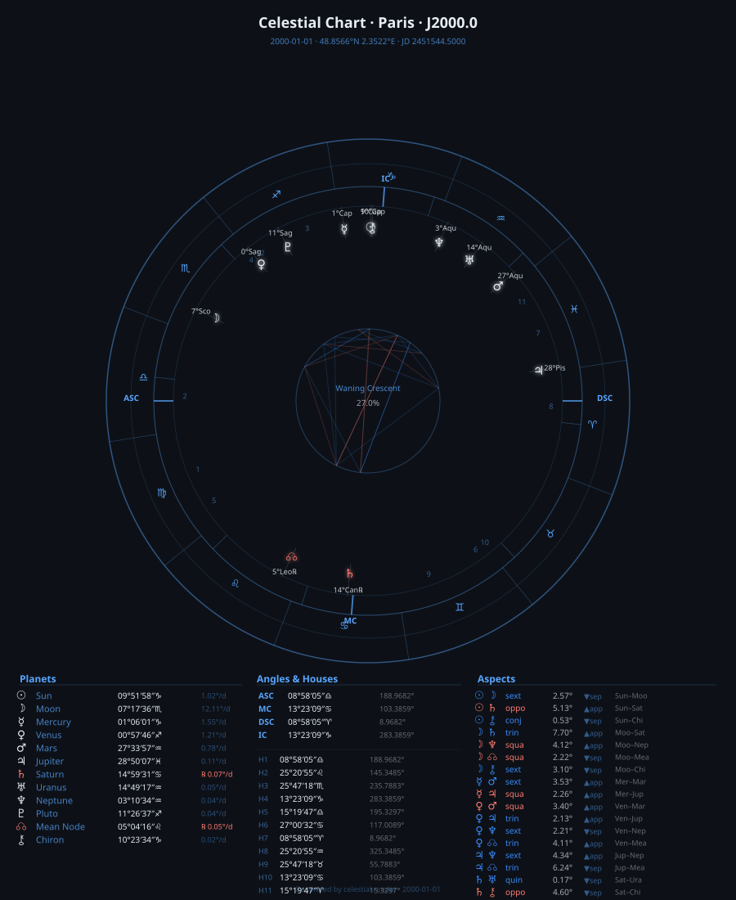

# celestial

[](https://github.com/geraldo-netto/celestial/actions/workflows/celestial-core.yml)
[](https://github.com/geraldo-netto/celestial/actions/workflows/celestial-cli.yml)
[](https://github.com/geraldo-netto/celestial/actions/workflows/celestial-python.yml)
[](https://github.com/geraldo-netto/celestial/actions/workflows/celestial-js.yml)
[](https://github.com/geraldo-netto/celestial/actions/workflows/celestial-php.yml)

A pure-Rust astronomical engine — no C compiler, no data files, **no external dependencies**.

Covers the Swiss Ephemeris API surface: planetary positions, house cusps, eclipses, crossings, rise/set, aspects, retrogrades, Vedic helpers, Celtic Wheel of the Year, and eight astrological traditions across 24 chart types.

---

## Table of Contents

- [Building from source](#building-from-source)
- [CLI](#cli)
  - [Commands](#commands)
  - [Examples](#examples)
  - [Chart rendering](#chart-rendering----celestial-render)
  - [Wheel enhancements](#wheel-enhancements)
  - [New Western chart types](#new-western-chart-types)
  - [Specialist Western charts](#specialist-western-charts)
  - [Vedic / Jyotish charts](#vedic--jyotish-charts)
  - [Hellenistic / Persian](#hellenistic--persian)
  - [Chinese astrology](#chinese-astrology)
  - [Mesoamerican calendars](#mesoamerican-calendars)
  - [Indigenous / other traditions](#indigenous--other-traditions)
- [Accuracy](#accuracy)
- **Documentation**
  - [docs/api\_reference.md](docs/api_reference.md) — complete Rust API reference, code examples
  - [docs/python.md](docs/python.md) — Python binding guide
  - [docs/javascript.md](docs/javascript.md) — JavaScript / TypeScript guide
  - [docs/php.md](docs/php.md) — PHP binding guide
  - [docs/index.md](docs/index.md) — workspace layout, CI pipelines, plugin architecture
- [License](#license)

---

## Building from source

```bash
# Full workspace build
cargo build

# Tests — 737 unit/integration/doc + 53 property-test suites
cargo test --package celestial-core -- --test-threads=1
cargo test --package celestial-cli
cargo run  --manifest-path fuzz/Cargo.toml

# Install CLI
cargo install --path cli

# Python wheel
cd bindings/python && maturin build --release

# Node.js addon
cd bindings/js && npm install && npm run build

# PHP extension
cd bindings/php && cargo build --release
```

---

## CLI

Install the `celestial` binary:

```bash
cargo install --path cli
```

### Commands

```
celestial calc      Geocentric planetary positions
celestial houses    House cusps and special angles
celestial sabbats   Celtic Wheel of the Year (8 sabbats)
celestial esbats    Named full moons
celestial jd        Julian day ↔ calendar date
celestial crossing  Next ecliptic longitude crossing
celestial eclipse   Solar and lunar eclipses
celestial chart     Full astrological chart — JSON output + SVG wheel
celestial moon      Moon phase, illumination, and next principal phases
celestial omer      Sefirat HaOmer — 49-day Omer count
celestial calendar  Multi-tradition religious calendars
                    jewish | easter | islamic | panchanga | vesak | nowruz
celestial render    Template-driven SVG chart rendering (24 chart types)
```

### Examples

```bash
# All nine planets, table output
celestial calc --date 2025-03-20

# Sidereal (Lahiri), selected bodies, JSON
celestial calc --date 2025-03-20 --body sun,moon --sidereal --mode lahiri --json

# Placidus cusps for Paris
celestial houses --date 2025-03-20 --lat 48.85 --lon 2.35

# Koch cusps for London
celestial houses --date 2025-03-20 --lat 51.5 --lon -0.12 --system koch

# Wheel of the Year
celestial sabbats --year 2025
celestial sabbats --next

# Full moons
celestial esbats --year 2025 --json
celestial esbats --next

# Date ↔ JD
celestial jd 2025-03-20
celestial jd --from-jd 2460754.5

# Next vernal equinox (Sun at 0°)
celestial crossing --body sun --lon 0 --from 2025-01-01

# Eclipses
celestial eclipse --type solar --from 2025-01-01
celestial eclipse --type lunar

# Full astrological chart
celestial chart \
  --date "1985-07-14 14:30" \
  --lat 48.8566 \
  --lon 2.3522 \
  --name "Bastille Day 1985" \
  --svg chart.svg

# Moon phases
celestial moon                          # current phase
celestial moon --date 2025-04-13        # phase at specific date
celestial moon --full                   # next full moon
celestial moon --month 2025-04          # all phases in April 2025
celestial moon --month 2025-04 --json

# Sefirat HaOmer
celestial omer                          # tonight's Omer day (if in Omer period)
celestial omer --date 2025-05-16        # Lag Ba'Omer
celestial omer --all --year 5785        # all 49 days
celestial omer --json

# Religious calendars
celestial calendar jewish --year 2025
celestial calendar easter --year 2025
celestial calendar islamic --year 2025
celestial calendar islamic --convert 2025-04-20
celestial calendar panchanga --date 2025-03-20
celestial calendar panchanga --festivals --year 2025
celestial calendar vesak --year 2025
celestial calendar vesak --uposatha --year 2025
celestial calendar nowruz --year 2025
celestial calendar nowruz --bahai --year 2025
```

All subcommands accept `--json` for machine-readable output.

---

### Chart rendering — `celestial render`

Produces SVG charts for 24 astrological chart types across eight traditions.



```bash
# Built-in SVG chart (dark theme, full legend)
celestial render --date 2025-03-20 --lat 48.85 --lon 2.35 --out chart.svg

# Override palette and title
celestial render --date now --lat 48.85 --lon 2.35 \
  --var "title=My Chart" --var "bg_color=#1a1a2e" --out chart.svg

# TOML config file
celestial render --config chart.toml --out chart.svg

# Bootstrap a custom template
celestial render --print-template > my_chart.tmpl

# Inspect all available template variables as JSON
celestial render --date 2025-03-20 --print-context
```

`chart.toml` example:

```toml
[render]
date  = "2025-03-20"
lat   = 48.8566
lon   = 2.3522
hsys  = "P"

[vars]
title        = "Spring Equinox 2025"
bg_color     = "#0d1117"
ring_color   = "#58a6ff"
```

Templates use [TinyTemplate](https://github.com/bheisler/TinyTemplate) syntax. All wheel geometry (planet x/y, cusp lines, aspect endpoints) is pre-computed in Rust — templates need no math, just `{planet.x}`, `{planet.y}`, etc.

| Variable | Type | Description |
|---|---|---|
| `{date}` | string | ISO date |
| `{jd}` | float | Julian Day |
| `{asc}` / `{mc}` / `{ic}` / `{dsc}` | float | Angle longitudes |
| `{asc_dms}` … | string | DMS formatted angles |
| `{planets}` | list | 12 bodies with `.lon .lat .x .y .glyph .dms .retro` |
| `{signs}` | list | 12 sign sectors with `.spoke_x1 .spoke_y1 .glyph_x .glyph_y` |
| `{houses}` | list | 12 cusps with `.x1 .y1 .x2 .y2 .num_x .num_y .dms` |
| `{aspects}` | list | Active aspects with `.x1 .y1 .x2 .y2 .orb .applying .is_hard` |
| `{moon_phase_name}` | string | Current lunar phase |
| `{moon_illumination}` | float | Illumination 0–100% |
| `{vars.key}` | string | Any `--var key=value` or `[vars] key = "value"` |

---

### Wheel enhancements

The natal wheel renders these additional layers automatically:

**Minor aspects** — seven new aspects as dashed lines at reduced opacity:

| Aspect | Angle | Orb |
|---|---|---|
| Semi-sextile | 30° | 2° |
| Semi-square | 45° | 2° |
| Quintile | 72° | 1.5° |
| Sesquiquadrate | 135° | 2° |
| Biquintile | 144° | 1.5° |
| Septile | 51.43° | 1° |
| Novile | 40° | 1° |

**Station markers** — planets with `|speed| < 0.05°/day` receive a small `S` badge.

**Antiscia and contra-antiscia** — each planet's antiscion (mirror over the 0°Cancer–0°Capricorn solstice axis) is shown as a faint glyph at the house ring:

```
antiscion(lon)         = (180° − lon) mod 360°
contra_antiscion(lon)  = (360° − lon) mod 360°
```

**Arabic Parts / Lots** — all seven traditional Arabic Parts placed on the wheel (Fortune, Spirit, Love, Necessity, Courage, Victory, Nemesis). Day/night reversal of Fortune and Spirit is applied automatically based on whether the Sun is above the horizon.

**Fixed stars** — 15 significant fixed stars (Algol, Aldebaran, Sirius, Regulus, Spica, Antares, etc.) plotted as magnitude-proportional dots on the sign band.

**Essential dignities table**:

| Status | Description |
|---|---|
| **domicile** | Planet rules the sign it occupies |
| **exaltation** | Planet is in its exaltation sign |
| **detriment** | Planet is in the sign opposite its domicile |
| **fall** | Planet is in the sign opposite its exaltation |
| peregrine | None of the above |

---

### New Western chart types

```bash
# Cosmogram (wheel without houses)
celestial render --date 2000-01-01 --lat 48.85 --lon 2.35 --type cosmogram

# Solar Return (specify the return year)
celestial render --date 1985-07-15 --lat 48.85 --lon 2.35 \
  --type solar-return --return-year 2025

# Lunar Return (search from --date2)
celestial render --date 1985-07-15 --lat 48.85 --lon 2.35 \
  --type lunar-return --date2 2025-01-01

# Secondary Progressions
celestial render --date 1985-07-15 --lat 48.85 --lon 2.35 \
  --type progressed --years 39.5

# Solar Arc Directions
celestial render --date 1985-07-15 --lat 48.85 --lon 2.35 \
  --type solar-arc --years 39.5

# Bi-wheel (synastry / transit overlay)
celestial render --date 1985-07-15 --lat 48.85 --lon 2.35 \
  --type biwheel --date2 2025-03-20
```

The bi-wheel draws natal planets as the inner ring and second-date planets on the outer ring (rendered in green). Cross-aspects between rings are shown as dashed lines.

---

### Specialist Western charts

```bash
# 90° Midpoint Dial (Uranian/Hamburg)
celestial render --date 2000-01-01 --lat 48.85 --lon 2.35 --type dial

# Composite chart (midpoint of two nativities)
celestial render --date 1985-07-15 --date2 1990-03-20 \
  --lat 48.85 --lon 2.35 --type composite

# Tri-wheel (natal + progressed + transits)
celestial render --date 1985-07-15 --date2 2010-01-01 --date3 2025-03-20 \
  --lat 48.85 --lon 2.35 --type triwheel

# Graphic Ephemeris (planetary motion over time)
celestial render --date 2025-01-01 --date2 2025-12-31 --type ephemeris

# Local Space chart (azimuth-based compass)
celestial render --date 2000-01-01 --lat 48.85 --lon 2.35 --type local-space
```

The **90° dial** compresses all four zodiacal quadrants onto a single circle. Midpoints triggered by a planet within 1.5° are shown as tick marks and listed in the legend.

The **graphic ephemeris** plots each planet's ecliptic longitude against time. Retrograde arcs and sign ingresses are immediately visible as changes in line direction.

---

### Vedic / Jyotish charts

All Vedic charts use sidereal (Lahiri ayanamsa) positions via `--type`:

```bash
# South Indian Rasi chart (fixed-sign 4×4 grid)
celestial render --date 1990-05-15 --lat 13.08 --lon 80.27 --type rasi

# North Indian chart (rotating diamond layout, lagna = ASC sign)
celestial render --date 1990-05-15 --lat 13.08 --lon 80.27 --type north-indian

# Navamsa D9 divisional chart
celestial render --date 1990-05-15 --lat 13.08 --lon 80.27 --type navamsa

# Vimshottari dasha timeline (120-year bar chart)
celestial render --date 1990-05-15 --lat 13.08 --lon 80.27 --type dasha

# Ashtakavarga (7×12 bindu table + Sarvashtakavarga totals)
celestial render --date 1990-05-15 --lat 13.08 --lon 80.27 --type ashtakavarga

# Shadbala planetary strength
celestial render --date 1990-05-15 --lat 13.08 --lon 80.27 --type shadbala
```

**Ashtakavarga** — 8-source bindu system. 7 planet rows × 12 sign columns (0–8 bindus each) plus a Sarvashtakavarga totals row (0–56). Green = strong (≥ 5 / ≥ 28), red = weak (≤ 2 / ≤ 18).

**Shadbala** — three strength components: Ochchabala (exaltation distance, max 60), Saptavargaja (sign placement), Chesta bala (motional strength). Total > 100 shashtiamsas = strong planet.

---

### Hellenistic / Persian

```bash
# Hellenistic natal chart with full dignity overlay
celestial render --date 1985-07-15 --lat 48.85 --lon 2.35 --type hellenistic

# Persian Firdaria timeline (75-year period chart)
celestial render --date 1985-07-15 --lat 48.85 --lon 2.35 --type firdaria

# Annual profection wheel (specify age with --years)
celestial render --date 1985-07-15 --lat 48.85 --lon 2.35 \
  --type profection --years 39
```

The **hellenistic** overlay adds a dignity table: dignity name, score, Egyptian term lord, Chaldean decan lord, triplicity rulers, and sect status for each planet.

**Firdaria** (Abū Maʿshar) — 75-year horizontal bar chart. Day charts start with Sun; night charts with Moon. Period lengths: Sun 10y · Venus 8y · Mercury 13y · Moon 9y · Saturn 11y · Jupiter 12y · Mars 7y · North Node 3y · South Node 2y.

**Profection** — the ASC advances one house per year of age. At age 35 the profected ASC is in house 12 (35 mod 12 + 1). The profection lord is highlighted in the legend.

Core Hellenistic API functions:

| Function | Description |
|---|---|
| `egyptian_terms_ruler(lon)` | Egyptian bounds planet for a longitude |
| `decan_ruler(lon)` | Chaldean decan (face) ruler |
| `triplicity_rulers(lon)` | `(day, night, participating)` triplicity rulers |
| `full_dignity(body, lon, is_day)` | Returns `(Dignity, score)` |
| `almuten(lon, is_day)` | Planet with highest dignity score at a degree |
| `is_day_chart(sun_lon, cusps)` | True if Sun is above the horizon |
| `same_sect(body, is_day)` | True if planet matches the chart's sect |
| `firdaria(jd, is_day, span_years)` | Vec of `FirdariaPeriod` |
| `annual_profection(cusps, age)` | `(house_number, profected_lon)` |
| `monthly_profection(cusps, age_years, months)` | Sub-annual profection |

---

### Chinese astrology

```bash
# Four Pillars of Destiny (Ba Zi)
celestial render --date 1985-07-15 --type bazi
```

The chart shows four pillars (Year, Month, Day, Hour), each with Heavenly Stem (天干), Earthly Branch (地支), element, and Yin/Yang polarity. An element balance bar chart shows Wood/Fire/Earth/Metal/Water distribution. The current solar term (节气) is displayed with degrees remaining until the next term.

| Function | Returns |
|---|---|
| `four_pillars(jd, hour_ut, sun_lon)` | `[BaZiPillar; 4]` — year, month, day, hour |
| `solar_term_position(sun_lon)` | `(current_idx, deg_into, next_idx, deg_to_next)` |
| `sexagenary_name(cycle_idx)` | `(stem_name, animal_name)` |
| `SOLAR_TERMS` | 24-entry array of `(longitude°, pinyin, english)` |
| `HEAVENLY_STEMS` | 10-entry array of `(name, element, yang)` |
| `EARTHLY_BRANCHES` | 12-entry array of `(name, animal, element, yang)` |

---

### Mesoamerican calendars

```bash
# Aztec + Maya calendar positions for any date
celestial render --date 2000-01-01 --type mesoamerican
```

| Calendar | Cycle | Description |
|---|---|---|
| Tonalpohualli | 260 days | Aztec ritual calendar: 20 day signs × 13 trecena numbers |
| Xiuhpohualli | 365 days | Aztec solar year: 18 months of 20 days + 5 Nemontemi |
| Tzolkin | 260 days | Maya sacred calendar (same cycle as Tonalpohualli) |
| Haab | 365 days | Maya vague year: 18 months + 5-day Wayeb |

The **Calendar Round** (52-year cycle) is LCM(260, 365) = 18,980 days. All calculations use the **GMT correlation** (constant 584,283).

| Function | Returns |
|---|---|
| `tonalpohualli(jd)` | `(trecena 1–13, sign_idx 0–19, nahuatl_name, english)` |
| `xiuhpohualli(jd)` | `(month_idx, day, month_name, english)` |
| `tzolkin(jd)` | `(trecena, sign_idx, mayan_name, english)` |
| `haab(jd)` | `(month_idx, day, month_name)` |
| `calendar_round(jd)` | `(tzolkin_trecena, tzolkin_sign, haab_day, haab_month)` |
| `GMT_CORRELATION` | `584_283i64` |

---

### Indigenous / other traditions

```bash
# Medicine Wheel + Egyptian decans
celestial render --date 2000-01-01 --lat 48.85 --lon 2.35 --type medicine-wheel
```

**Medicine Wheel** — compass-rose wheel using the Sun Bear / Wabun Wind synthesis (1980). 12 birth totems correspond to ~30° Sun longitude segments: Snow Goose · Otter · Cougar · Red Hawk · Beaver · Deer · Flicker · Sturgeon · Brown Bear · Raven · Snake · Elk. Each totem belongs to a clan (Turtle/Earth, Butterfly/Air, Thunderbird/Fire, Frog/Water) and a season.

**Egyptian decans** — each of 36 ten-degree ecliptic sections corresponds to a traditional decan name (Firmicus Maternus / Ptolemy) and its heliacal rising star.

| Function | Returns |
|---|---|
| `medicine_wheel_totem(sun_lon)` | `(animal, element, clan, season)` |
| `egyptian_decan(lon)` | `(decan_idx 0–35, decan_name, rising_star)` |

> **Note:** The Medicine Wheel system presented here is the Sun Bear synthesis from *The Medicine Wheel* (1980). Traditional indigenous astronomical knowledge varies enormously by nation and is generally observational and seasonal, not a natal chart system. This implementation is labelled accordingly in the SVG output.

---

## Accuracy

| Body | Longitude | Latitude | Distance |
|---|---|---|---|
| Sun | ~1″ | ~0.1″ | ~0.00001 AU |
| Moon | ~10″ | ~4″ | ~4 km |
| Inner planets | ~1″–30″ | ~1″–10″ | ~0.001 AU |
| Outer planets | ~1″–60″ | ~1″–30″ | ~0.01 AU |

Accuracy degrades beyond ±3000 years from J2000. Nutation: **IAU 2000B** luni-solar series (77 terms, ~1 mas accuracy). Obliquity: **IAU 2006** formula.

Precision vs Meeus *Astronomical Algorithms* 2nd ed. using `calc()` (TT input):

| Body | Error | Model |
|---|---|---|
| Sun 1992-Oct-13 | 3.2″ | VSOP87 + IAU 2000B nutation |
| Moon 1992-Apr-12 | 0.7″ | ELP2000-82 + IAU 2000B nutation |
| julday J2000 | exact | — |

---

## License

Released under **AGPL-3.0**, matching the Swiss Ephemeris it emulates.

The helper functions (`aspects.rs`, `searches.rs`, `vedic.rs`, `geoformat.rs`, `timezone.rs`, `datetime.rs`) are a Rust port of [swephelp](https://github.com/astrorigin/swephelp) by Stanislas Marquis (© 2007–2020, GPL-2).
